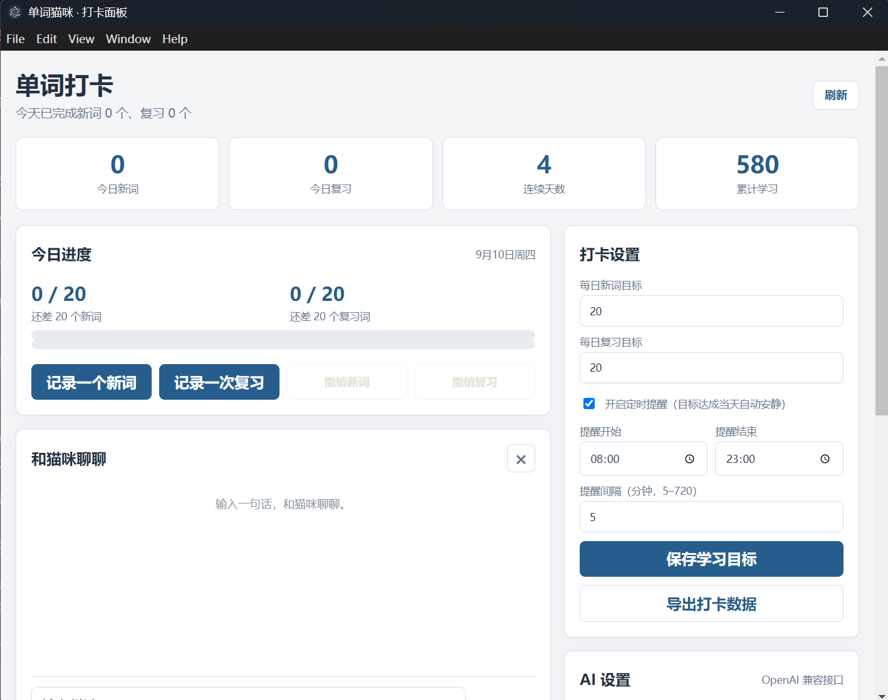
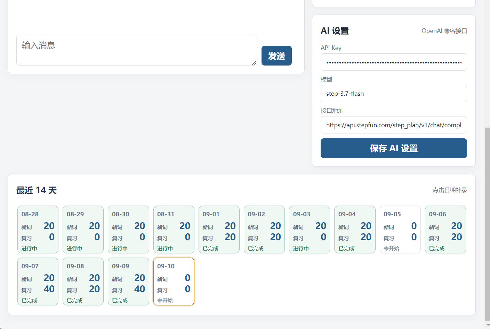

# 单词猫咪桌宠

基于 Electron 的 Windows 桌宠应用。一只白色小猫会置顶显示在桌面，陪你记录每天的新词和复习。


## 下载安装（普通用户看这里）

1. 前往 [Releases 页面](https://github.com/Arland123/word-cat-desktop-pet/releases)；
2. 在最新版本的 Assets 里下载 `word-cat-desktop-pet-<版本号>.exe`（免安装便携版）；
3. 双击运行，小猫会出现在桌面右下角，开始打卡吧！

- 系统要求：Windows 10 / 11（x64）。
- 首次运行如遇 SmartScreen 提示“未知发布者”，点击“更多信息”→“仍要运行”（应用未做代码签名）。
- 数据全部保存在本机，删除程序不会自动删除打卡数据。

## 快速上手

1. 右键小猫 → **打开打卡面板**；
2. 在右侧“AI 设置”里填入 API Key、模型和接口地址（见下文 [AI 陪聊](#ai-陪聊openai-兼容接口)），点击“保存 AI 设置”；
3. 在“打卡设置”里设定每日新词/复习目标，点击“保存学习目标”；
4. 点击“记录一个新词”，或者直接对猫咪说“记 3 个新词”；
5. 右键小猫可以**选择形象**（工作喵/睡觉喵/发呆喵）和调整**大小**；悬停在猫身上按住 Ctrl 滚轮可微调大小。




## 功能

- 三种小猫形象：右键可在工作喵、睡觉喵和发呆喵之间切换，并自动记住选择
- 小猫桌宠：置顶、可拖动、呼吸动画
- 分别记录每日新词和复习词数量，支持撤销和历史补录；聊天记录的打卡按整批撤销
- 桌宠大小可调：右键菜单预设档位（75%–150%），按住 Ctrl 滚轮微调，自动记住大小
- 与桌宠聊天（任意 OpenAI 兼容接口，默认 StepFun）；聊天里输入单词/短语可查询释义和用法；生成回复时可点击“停止”中断
- 聊天记录打卡后，桌宠气泡和面板弹窗即时反馈，跨越目标线时额外庆祝
- 打卡数据变更即时同步：聊天里记录后无需手动刷新面板
- 定时提醒：在设定时段内按间隔用桌宠气泡提醒（目标达成当天自动安静），时段与间隔可在面板调整
- 数据安全：启动时自动滚动备份最近 3 份到 `backups/` 目录，面板一键导出完整数据为 JSON
- 每日新词目标、每日复习目标、连续达标天数统计
- 最近 14 天记录，点击日期补录
- 桌宠左键反馈今日进度，右键打开菜单
- 右键小猫可打开独立的小型聊天面板，自动避开桌宠位置
- 关闭面板只是隐藏，猫咪仍会留在桌面
- Windows 登录后自动启动桌宠；开机启动时不会自动打开大面板

## 从源码运行（开发者）

需要 Node.js（建议 18 及以上）和 npm：

```bat
git clone https://github.com/Arland123/word-cat-desktop-pet.git
cd word-cat-desktop-pet
npm install
npm start
```

双击 `start.bat` 等效于 `npm start`（需先完成 `npm install`）。打包便携版：`npm run dist`，产物在 `dist\` 目录；也可以直接推送一个 `v*` 标签到 GitHub，Actions 会自动构建并发布 Release（见 `.github/workflows/release.yml`）。

## AI 陪聊（OpenAI 兼容接口）

在面板右侧“AI 设置”填写 API Key、模型和接口地址。接口协议为 OpenAI 兼容的 chat completions，因此不限定供应商：默认（StepFun）地址为 `https://api.stepfun.com/step_plan/v1/chat/completions`、默认模型 `step-3.7-flash`。换其他供应商（如 DeepSeek、Kimi、OpenRouter）时填对方的接口地址、模型名和对应 Key 即可；地址填基础地址（为空或以 `/v1` 结尾）时程序会自动补全 `/chat/completions`，填完整地址则原样使用。本地模型（如 Ollama）也可以用 `http://localhost` 或 `http://127.0.0.1` 地址（本机地址允许 http，其他地址要求 https）。也可以在启动前设置 `AI_API_KEY` 环境变量（旧的 `STEPFUN_API_KEY` 仍然有效）。API 请求由 Electron 主进程发出，聊天记录仅保存在当前会话内。旧配置里的 `stepfunApiKey` 等字段会在启动时自动迁移到新字段，无需手动处理。

小猫的聊天人格设定保存在项目根目录的 `cat-personality.md`。直接编辑该文件即可调整身份、语气和提醒规则；开发模式（`npm start`）下保存后发送下一条消息即可生效。注意：打包版把该文件打包进了 `app.asar`，修改后需要重新执行 `npm run dist` 才能在打包版里生效。

每次聊天都会同时传入最新的打卡数据（今日数量、每日目标、连续达标天数、累计数量和近 7 天记录），因此小猫可以基于真实进度进行反馈。

### 用聊天指令操作打卡

聊天框会先让 AI 判断你的自然语言意图，再由本地程序校验并执行打卡操作：

- `记 3 个新词`、`今天背了五个新词`
- `复习 5 个词`、`新词 3 个，复习 5 个`
- `撤销一次打卡`
- `把今天复习词改成 20 个`
- `打开打卡面板`、`打开聊天面板`
- 记录历史日期时可说 `前天复习 20 个词`、`记录 2026年9月1日的新词 3 个`

指令执行后会立即保存到指定日期并刷新面板；普通聊天不会因为提到“新词”而自动修改数据。执行这些指令需要已配置 API Key。

## 数据与隐私

- 打卡数据只保存在本机 `%APPDATA%\word-cat-desktop-pet\word-cat\state.json`；GitHub 仓库和发布程序均不包含任何用户数据或密钥。
- 应用唯一的网络请求是聊天：每次对话会把当日学习统计（数量、目标、连续天数、近 7 天记录）发送给你配置的 AI 服务商，不包含 API Key 和其他个人信息。除聊天外没有任何遥测或上报。
- 启动时自动滚动备份最近 3 份到同目录 `backups\`；“导出打卡数据”可随时导出完整 JSON。
- 彻底卸载：托盘菜单退出应用后，删除上述用户数据目录；再在 Windows“设置 → 应用 → 启动”里关闭 `word-cat-desktop-pet` 的开机自启。

## 常见问题

- **提示“暂时没连上 AI 接口”**：依次检查 AI 设置里是否已填 Key 并保存、网络能否访问接口地址、是否需要代理。
- **怎么关掉开机自启**：打开 Windows“设置 → 应用 → 启动”，关闭 `word-cat-desktop-pet`。
- **怎么彻底退出**：右键小猫（或托盘图标）→ 退出；关闭面板/聊天窗只是隐藏，猫咪仍在桌面。
- **打卡数据会丢吗**：正常不会；误删可从用户数据目录 `backups\` 里取最近 3 份自动备份，平时建议用“导出打卡数据”留档。
- **改了 `cat-personality.md` 没生效**：开发模式（`npm start`）即时生效；打包版需要重新 `npm run dist`。
